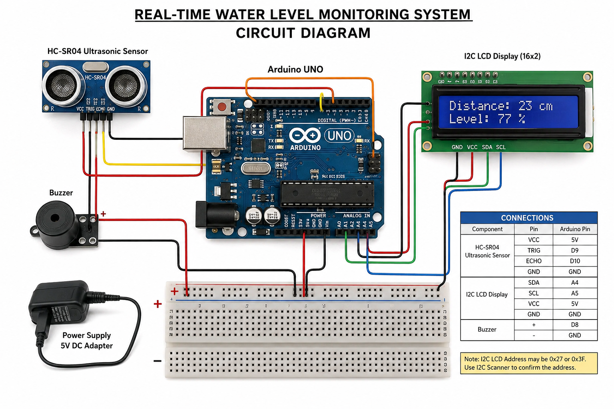

# 🚰 Real-Time Water Level Monitoring System using Ultrasonic Sensor

A reliable and cost-effective water level monitoring system using an ultrasonic sensor and Arduino. The system continuously measures water level, displays it on an I2C LCD, and triggers a buzzer alert when a predefined threshold is reached to prevent overflow.

---

## 📌 Features

* 📏 **Real-time measurement** using HC-SR04 ultrasonic sensor
* 📊 **Percentage-based** tank level calculation
* 📟 **I2C LCD display** (16x2) for status output
* 🔊 **Buzzer alert** when tank reaches threshold (e.g., 80%)
* 🖥️ **Serial monitor** output for real-time debugging
* ⚙️ **Noise filtering** and calibration for high accuracy

---

## 🛠️ Hardware Components

* **Arduino Uno** (or compatible)
* **HC-SR04** Ultrasonic Sensor
* **I2C LCD Display** (16x2)
* **Buzzer** (Active or Passive)
* Jumper wires & Breadboard

---

## 🔌 Circuit Connections

### Ultrasonic Sensor
* **VCC** → 5V
* **GND** → GND
* **TRIG** → D9
* **ECHO** → D10

### I2C LCD
* **VCC** → 5V
* **GND** → GND
* **SDA** → A4 (or dedicated SDA pin)
* **SCL** → A5 (or dedicated SCL pin)

### Buzzer
* **Positive (+)** → D8
* **Negative (-)** → GND

---

## ⚙️ Working Principle

1. **Measurement:** The ultrasonic sensor emits sound waves and calculates the time taken for the echo to return from the water surface.
2. **Conversion:** This time is converted into distance (cm).
3. **Calculation:** The water level percentage is calculated based on the total tank height.
4. **Action:**
   * If `level >= threshold`, the buzzer sounds and the LCD shows "TANK FULL".
   * Otherwise, the current distance and level are displayed normally.

---

## 📐 Formula Used

**Distance calculation:**
`distance = (duration × 0.034) / 2`

**Water level:**
`level (%) = ((tankHeight - distance) / tankHeight) × 100`

---

## 🔧 Configuration

You can modify these parameters in `src/water_level_monitor.ino`:

```cpp
int tankHeight = 100;   // Tank height in cm
int threshold = 80;     // Alert level %
int offset = 2;         // Calibration offset
```

---

## 📸 Project Preview

| Circuit Diagram | Working Demo |
| :---: | :---: |
|  |  |

*(Add your images to the `docs/` folder to see them here)*

---

## 🚀 How to Run

1. **Clone** this repository.
2. **Open** `src/water_level_monitor.ino` in the Arduino IDE.
3. **Install** required library:
   * `LiquidCrystal_I2C` (via Library Manager)
4. **Select Board:** Arduino Uno.
5. **Upload** the code.
6. **Open Serial Monitor** at 9600 baud.

---

## 📜 License

This project is open-source and available under the **MIT License**.

---

## 👨‍💻 Author

**Uday V**
[GitHub Profile](https://github.com/uday0438)
